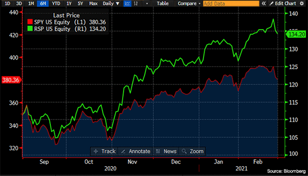
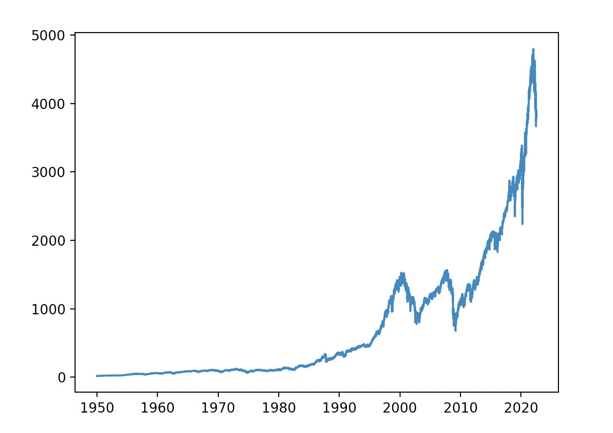

# Repository Overview
This repository uses time-series data from the S&P 500 to train a RandomForestClassifier to predict the probability of a stock price increasing or decreasing. 


We will use the Yahoo Finance API to get historical data for the S&P500 (^GSPC). Yahoo Finance offers an excellent range of market data on stocks, bonds, currencies, and cryptocurrencies. It also provides news reports with various insights into different markets from around the world

## Install Yahoo Finance API
```
$ pip install yfinance 
```

## Load Yahoo Finance API 
```python
import yfinance as yf
sp500 = yf.Ticker("^GSPC")
sp500 = sp500.history(period="max")
```

## Install matplotlib

```
$ pip install matplotlib
```

## Load matplotlib
```python
import matplotlib.pyplot as plt
```

## Plot S&P 500 Index
```python
plt.plot(sp500.index, sp500["Close"])
plt.show()
```



## Set up Target Variables

```python
sp500["Tomorrow"] = sp500["Close"].shift(-1)
sp500["Target"] = (sp500["Tomorrow"] > sp500["Close"]).astype(int) 
sp500 = sp500.loc["1990-01-01":].copy()
```

## Train ML Model

### Install sklearn library
```
$ pip install sklearn
```

### Import Random Forrest Classifier
```python
from sklearn.ensemble import RandomForestClassifier
from sklearn.metrics import precision_score
```